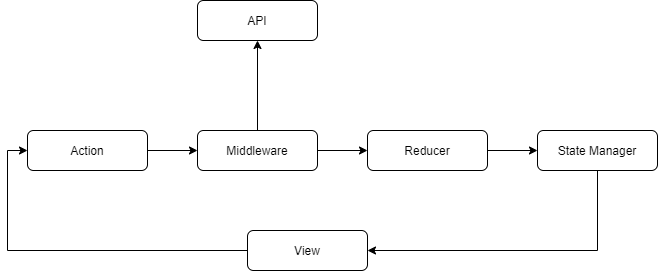

# Introduction
*Nano isn't production-ready yet, it's in an early stage of development, you can always create an issue for suggestions*

An application architecture pattern than a framework for Flutter utilizing a unidirectional data flow.

The goal of Nano is to make it easy to separate the business logic from the presentation layer, with modular state management to allow developers to build smaller parts, that can be tested in isolation. Nano is highly focused on architectural pattern and code structure that's scalable and modular to increase code re-usability with less to no refactoring.

Nano is heavily inspired by existing solutions like Redux, BLoC pattern and Flux. Internally Nano has nothing out of ordinary for state management, it's just streams on top of rxdart and some helper functions to make your life easier. 
****
Nano's unidirectional data flow diagram




**Store**

- Contains the application state
- It has computed values as getters and helper functions
- Store takse a Mutation Type which act as an input for the reducer
- Events are emitted as Streams
- State can't be changed directly from outside

```dart
//Accepted mutation by this store
enum CounterMutation {
  increment,
  decrement,
  error,
}

class CounterState extends StateManager<int, CounterMutation> {
    //initial state as 0
  CounterState() : super(0);
}
```

**Reducer**

- Pure function simillar to Redux
- Receive Mutation as input and update the state as output
- Same mutations will always generate same results

```dart
class CounterState extends StateManager<int, CounterMutation> {
  CounterState() : super(0);

  @override
  void reducer(mutation){
    switch (mutation) {
      case CounterActions.increment:
        updateState(cData + 1);
        break;
      case CounterActions.decrement:
        updateState(cData - 1);
        break;
      case CounterActions.error:
        updateStateWithError("Invalid action");
        break;
      default:
        throw Exception("Invalid action");
    }
  }
}
```

**Action**

- Actions cause change in the state
- Actions contains set of mutations, which are called once the action has been completed.
- Actions has full aschronous support
- All the API calls are performed in the actions body

```dart
//without any body
final incrementRef = ActionRef<CounterStore, Null>(
  mutations: (_, payload) => [Mutation(payload, IncrementMutation())],
);

//with body
final setRef = ActionRef<CounterParam, void>(
  body: (payload) async {
    await Future.delayed(Duration(milliseconds: payload.seconds));
  },
  mutations: (result, payload) =>
      [Mutation(payload.store, CountMutation(payload.count))],
);
```

**Dispatcher**

 - Dispatcher is a singleton where all the actions go through
 - Dispatcher doesn't registers store refernces
 - The actions provided contains mutation with reference to the store and mutation type
- Dispatcher manages order of Actions execution

```dart
    // There are multiple ways to dipatch actions depending upon the
    // situation but this is what will be used most of times
    final counter = CounterStore();
    //sync
    await setRef(CounterParam(counter, 5, 200)).run();
    //async
    setRef(CounterParam(counter, 5, 200)).run();
```